# Builder Session - WPS201

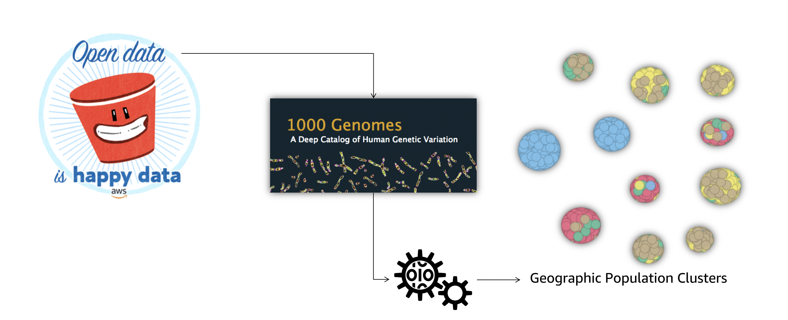

## Session Description

The development and application of machine learning (ML) models is a vital part of scientific and technical computing. Increasing model training data size generally improves model prediction and performance, but deploying models at scale is a challenge. Participants in this builder session learn to use Amazon SageMaker, an AWS service that simplifies the ML process and enables training on cloud-stored datasets at any scale. Attendees walk through the process of building a model, training it, and applying it for prediction against large open scientific datasets, such as the 1000 Genomes data. By the end of the session, attendees have the resources and experience to start using Amazon SageMaker and related AWS services to accelerate their scientific research and time to discovery.

## Prerequisites

Attendees are encouraged to have the following:

* Administrative access to an AWS Account
* Familiarity with the [Python](https://python.org) programming language
* Familiarity with [Jupyter](https://jupyter.org) [Notebooks](https://jupyter-notebook.readthedocs.io/en/stable/)

## Source code

The source code for this session is hosted on [GitHub](https://github.com/wleepang/reinvent-2018-wps201).

## Getting started

### Applying credits to your account

1. Sign-in to the [AWS Console](http://console.aws.amazon.com/)
2. Go to the Billing Console

    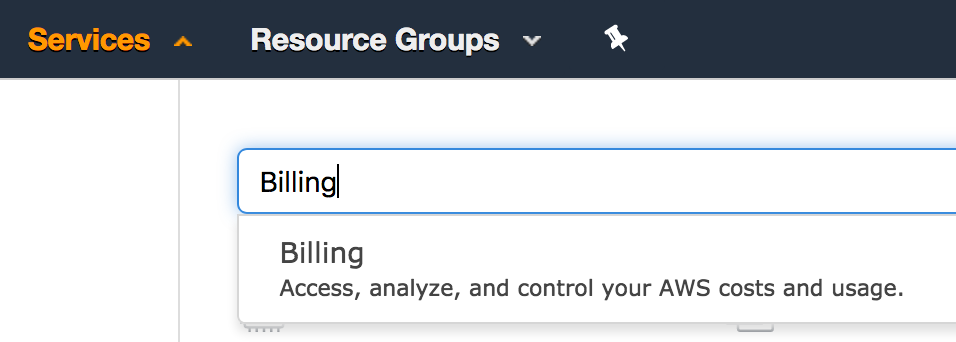

3. Click on "Credits" in the list on the left

    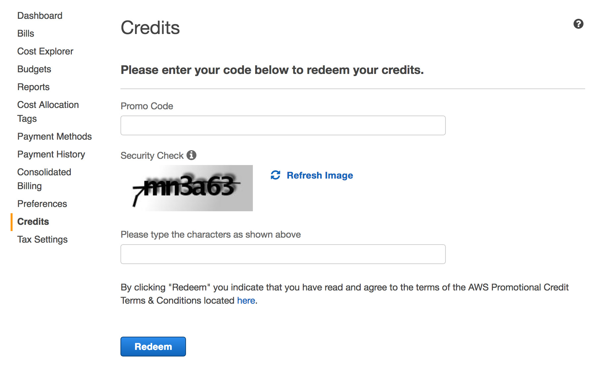

4. Enter your credit code in the "Promo Code" box
5. Enter the Security check text
6. Click on the "Redeem" button

### Create resources with CloudFormation

For this session, we'll use CloudFormation to create the following infrastructure

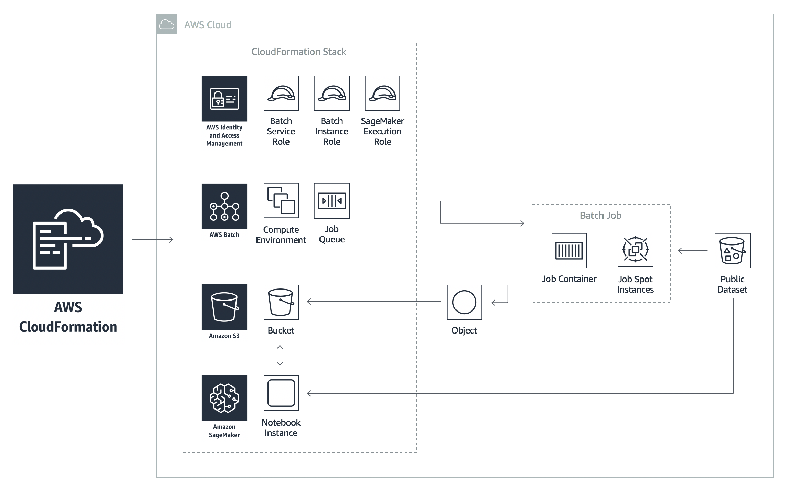

!!! warning
    The CloudFormation templates used will create IAM roles.  In order for the
    stack to be successfully created you **must** have Administrative access to
    the AWS Account used.

<a class="btn btn-warning btn-block" target="_blank"
    href="https://console.aws.amazon.com/cloudformation/home?#/stacks/new?stackName=wps201&templateURL=https://s3.amazonaws.com/reinvent-2018-wps201/templates/wps201-root-novpc.template.yaml">
    Launch Stack
</a>

Clicking the button above will take you to a CloudFormation Console.
When the console opens, do the following:

1. On the "Select Template" page, click the "Next" button
2. On the "Specify Details" page:

    1. Use the pre-populated stack name ("wps201")

    2. Select a VPC.  This will be where EC2 instances created by AWS Batch will be launched.
       If you have multiple VPCs you can either use your default one (the CIDR block starts with 172),
       or one that already exists in your account.

        

    3. Select at least one subnet id.  This should be in the VPC you selected.
       Again, you can tell by the CIDR block which VPC a subnet is in.

        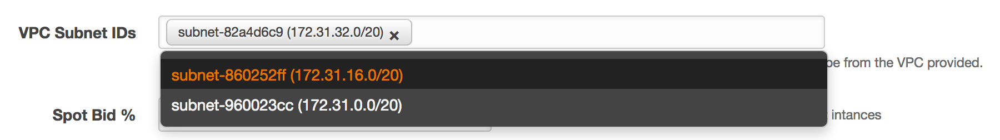

    4. (Optional) Specify the Spot bid percentage relative to On-Demand pricing.
       This is the maximum bid price for a Spot instance AWS Batch will use.
       Batch will not launch an instance if spot instance pricing goes above this value.

3. Click "Next" through the "Options" page:

4. On the "Review" page be sure to check the boxes acknowledging IAM resource creation and 
   the requirement for CAPBILITY_AUTO_EXPAND

    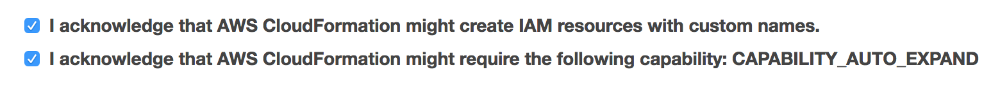

5. Click the "Create" button

Stack creation should take about 5-10min to complete.  If successful, your CloudFormation
will look like the following:

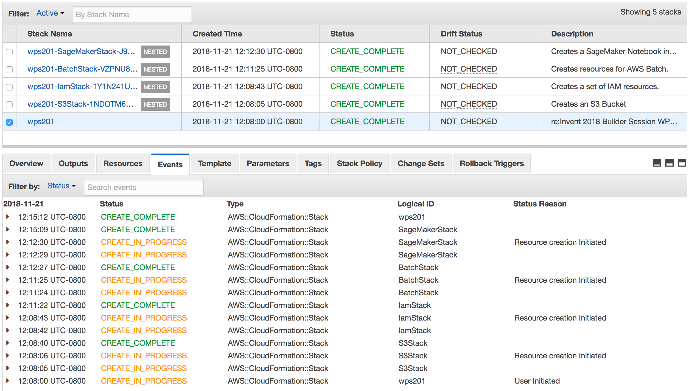

### Open your SageMaker notebook instance

1. Go to the Amazon SageMaker Console
   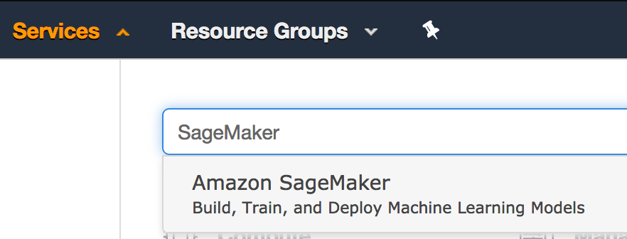

2. Go to "Notebook Instances".  The instance for this session should be listed.
   Click on the "Open Jupyter" link next to the instance.
   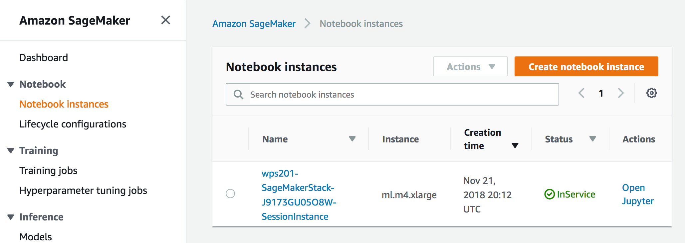

3. Open the Jupyter Notebook `wps201-* / genome-kmeans-py3.ipynb`:
   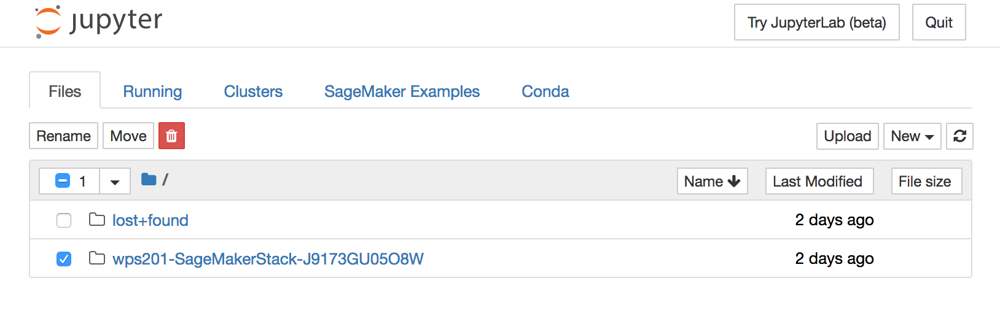
   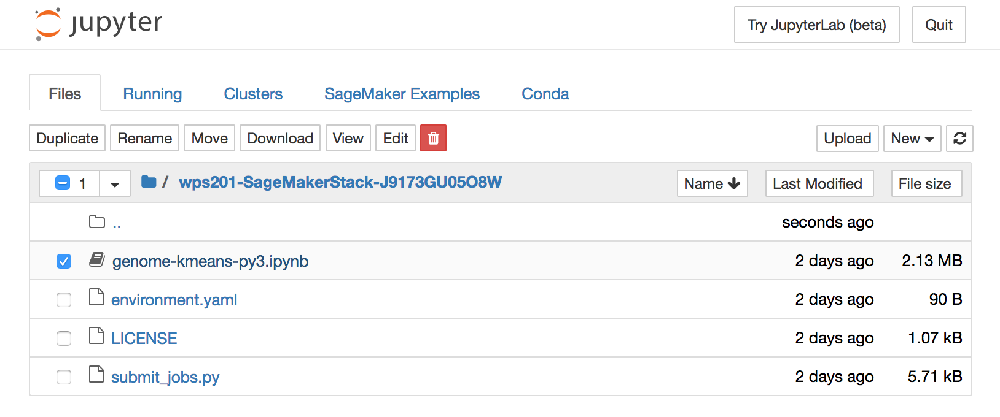